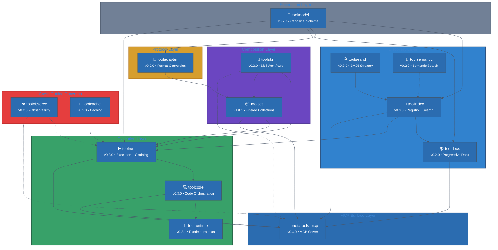
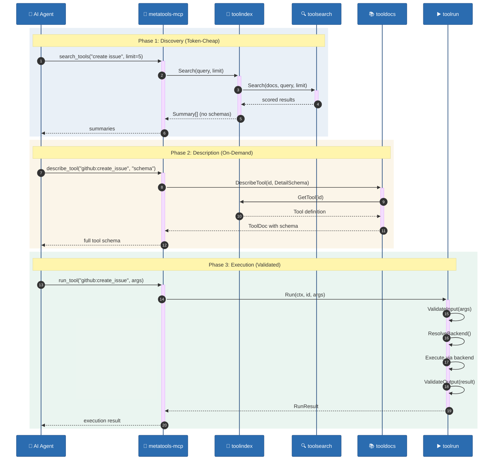
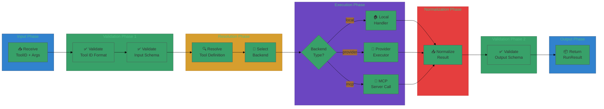
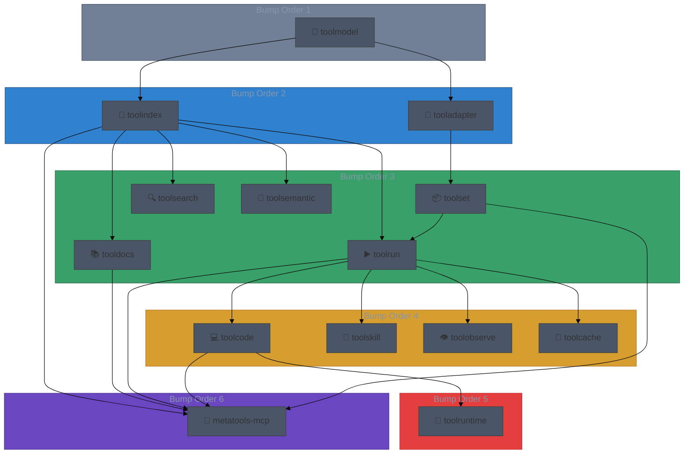
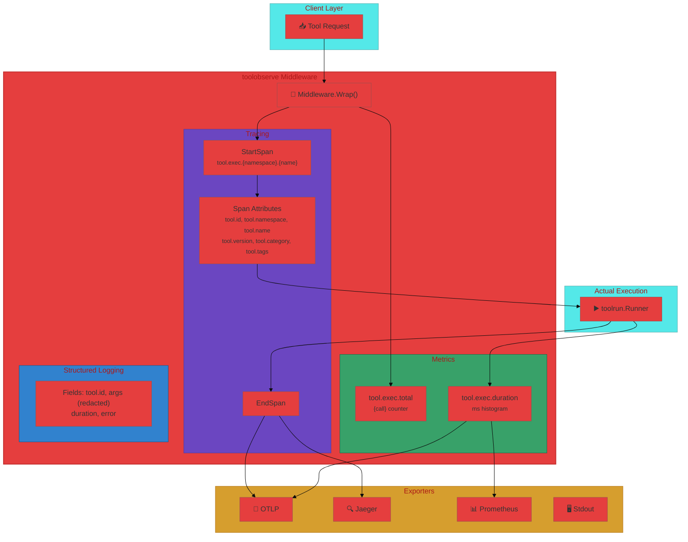

# Stack Architecture

This stack is built around progressive disclosure and a clean separation of
schema, discovery, docs, execution, and transport.

---

## System Context (C4 Level 1)

High-level view showing the ApertureStack and its external actors.

```mermaid
%%{init: {'theme': 'base', 'themeVariables': {'primaryColor': '#1a365d', 'primaryTextColor': '#fff', 'primaryBorderColor': '#2c5282', 'lineColor': '#4a5568', 'secondaryColor': '#2d3748', 'tertiaryColor': '#e2e8f0'}}}%%
flowchart TB
    subgraph external["External Systems"]
        Agent["🤖 AI Agent<br/><small>Claude, GPT, etc.</small>"]
        ExtMCP["📡 External MCP Servers<br/><small>GitHub, Filesystem, etc.</small>"]
        Backends["⚙️ Execution Backends<br/><small>Docker, K8s, WASM</small>"]
    end

    subgraph aperture["ApertureStack"]
        direction TB
        MCP["🔷 metatools-mcp<br/><small>MCP Server Surface</small>"]
    end

    subgraph observability["Observability"]
        OTLP["📊 OTLP Collector"]
        Prometheus["📈 Prometheus"]
        Jaeger["🔍 Jaeger"]
    end

    Agent -->|"MCP Protocol<br/>JSON-RPC"| MCP
    MCP -->|"Tool Calls"| ExtMCP
    MCP -->|"Code Execution"| Backends
    MCP -.->|"Traces"| OTLP
    MCP -.->|"Metrics"| Prometheus
    OTLP --> Jaeger

    style aperture fill:#1a365d,stroke:#2c5282,stroke-width:3px
    style external fill:#2d3748,stroke:#4a5568,stroke-width:2px
    style observability fill:#2f855a,stroke:#276749,stroke-width:2px
```

---

## Layering Model (All 14 Components)

Complete view of all stack components organized by architectural layer.

---

## Progressive Disclosure Pipeline

---

## Tool Execution and Runtime Isolation

---

## Search Strategy Layering

---

## Component Dependency Graph

Directed acyclic graph showing module dependencies and bump order.

---

## Observability Integration

How toolobserve wraps around tool execution with traces, metrics, and logs.

