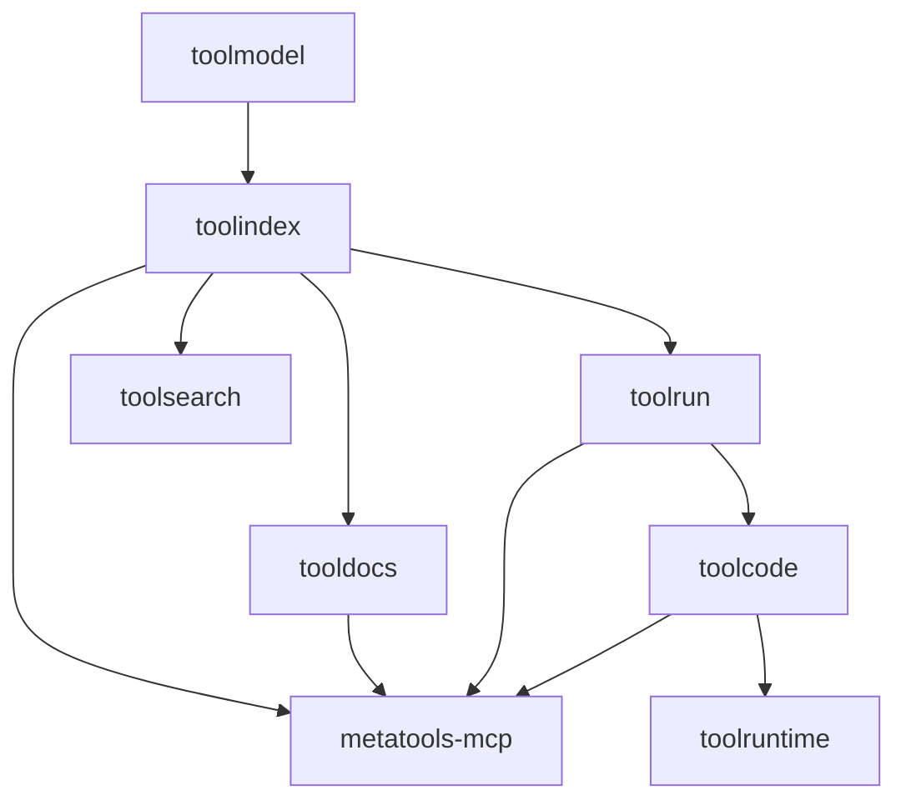
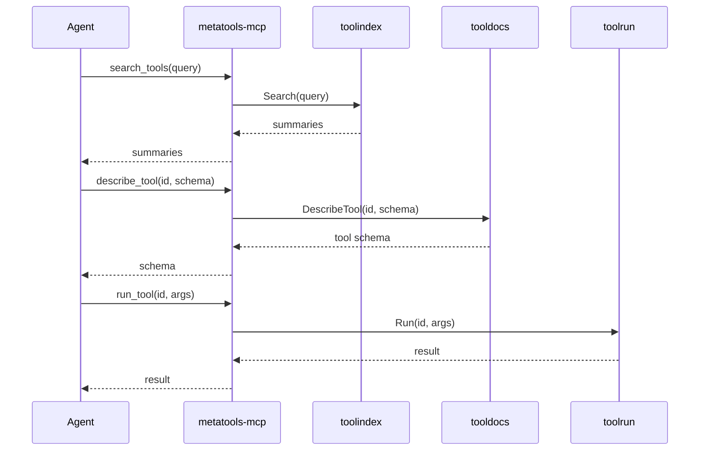
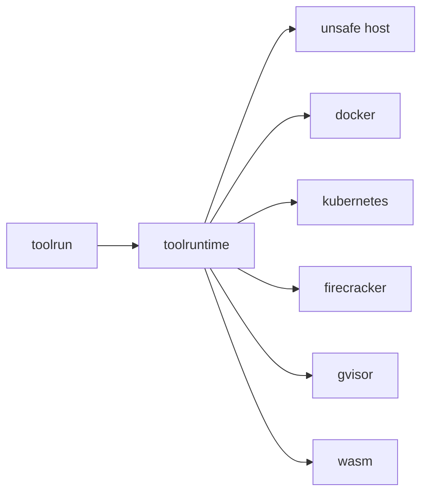
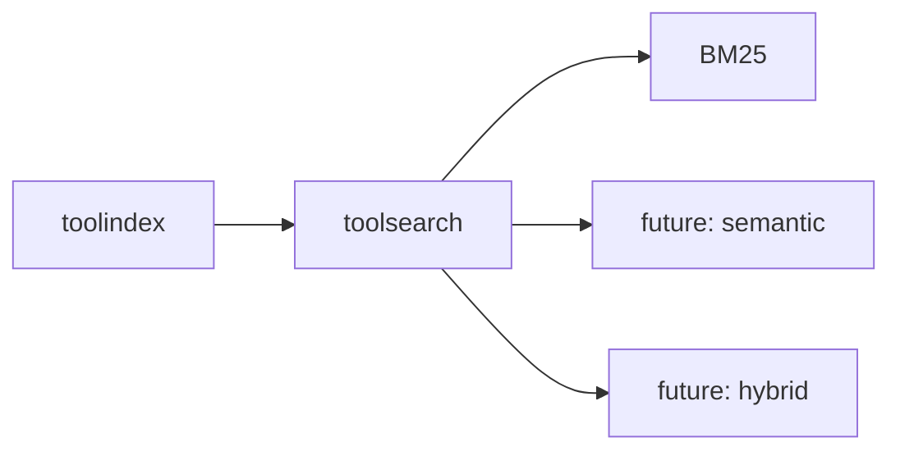

# Stack Architecture

This stack is built around progressive disclosure and a clean separation of
schema, discovery, docs, execution, and transport.

## Layering model

## Progressive disclosure pipeline

## Tool execution and runtime isolation

## Search strategy layering

