# Stack Architecture

This stack is built around progressive disclosure and a clean separation of
schema, discovery, docs, execution, and transport.

See also: `architecture/stack-map.md` and `architecture/protocol-crosswalk.md`.

---

## System Context (C4 Level 1)

High-level view showing the ApertureStack and its external actors.

```mermaid
%%{init: {'theme': 'base', 'themeVariables': {'primaryColor': '#1a365d', 'primaryTextColor': '#fff', 'primaryBorderColor': '#2c5282', 'lineColor': '#4a5568', 'secondaryColor': '#2d3748', 'tertiaryColor': '#e2e8f0'}}}%%
flowchart TB
    subgraph external["External Systems"]
        Agent["🤖 AI Agent<br/><small>Claude, GPT, etc.</small>"]
        ExtMCP["📡 External MCP Servers<br/><small>GitHub, Filesystem, etc.</small>"]
        Backends["⚙️ Execution Backends<br/><small>Docker, K8s, WASM</small>"]
    end

    subgraph aperture["ApertureStack"]
        direction TB
        MCP["🔷 metatools-mcp<br/><small>MCP Server Surface</small>"]
        A2A["🧩 metatools-a2a<br/><small>A2A Server Surface</small>"]
    end

    subgraph observability["Observability"]
        OTLP["📊 OTLP Collector"]
        Prometheus["📈 Prometheus"]
        Jaeger["🔍 Jaeger"]
    end

    Agent -->|"MCP Protocol<br/>JSON-RPC"| MCP
    Agent -->|"A2A Protocol<br/>JSON-RPC/REST"| A2A
    MCP -->|"Tool Calls"| ExtMCP
    MCP -->|"Code Execution"| Backends
    A2A -->|"Tool Calls"| ExtMCP
    A2A -->|"Code Execution"| Backends
    MCP -.->|"Traces"| OTLP
    MCP -.->|"Metrics"| Prometheus
    A2A -.->|"Traces"| OTLP
    A2A -.->|"Metrics"| Prometheus
    OTLP --> Jaeger

    style aperture fill:#1a365d,stroke:#2c5282,stroke-width:3px
    style external fill:#2d3748,stroke:#4a5568,stroke-width:2px
    style observability fill:#2f855a,stroke:#276749,stroke-width:2px
```

---

## Layering Model (Consolidated Stack)

Complete view of the consolidated repositories organized by layer.

```mermaid
%%{init: {'theme': 'base', 'themeVariables': {'primaryColor': '#2b6cb0', 'primaryTextColor': '#fff', 'lineColor': '#4a5568'}}}%%
flowchart TB
    subgraph surface["Protocol Surface Layer"]
        direction LR
        metatools["🔷 metatools-mcp<br/><small>v0.5.2 • MCP Server</small>"]
        metatoolsA2A["🧩 metatools-a2a<br/><small>v0.1.0 • A2A Server</small>"]
    end

    subgraph protocol["Protocol Layer"]
        direction LR
        toolprotocol["📡 toolprotocol<br/><small>v0.1.5 • Transports + Wire</small>"]
    end

    subgraph operations["Operations Layer"]
        direction LR
        toolops["👁️ toolops<br/><small>v0.1.4 • Observe/Cache/Auth</small>"]
    end

    subgraph composition["Composition Layer"]
        direction LR
        toolcompose["📦 toolcompose<br/><small>v0.1.2 • Set + Skill</small>"]
    end

    subgraph execution["Execution Layer"]
        direction LR
        toolexec["▶️ toolexec<br/><small>v0.1.4 • Run/Code/Runtime</small>"]
    end

    subgraph discovery["Discovery Layer"]
        direction LR
        tooldiscovery["📇 tooldiscovery<br/><small>v0.2.2 • Index/Search/Docs</small>"]
    end

    subgraph foundation["Foundation Layer"]
        direction LR
        toolfoundation["🧱 toolfoundation<br/><small>v0.2.0 • Model/Adapter/Version</small>"]
    end

    toolfoundation --> tooldiscovery
    toolfoundation --> toolexec
    toolfoundation --> toolprotocol
    toolfoundation --> toolops
    toolfoundation --> toolcompose

    tooldiscovery --> toolcompose
    toolexec --> toolcompose

    toolprotocol --> metatools
    toolops --> metatools
    toolcompose --> metatools
    toolexec --> metatools
    tooldiscovery --> metatools
    toolfoundation --> metatools

    toolprotocol --> metatoolsA2A
    toolops --> metatoolsA2A
    toolcompose --> metatoolsA2A
    toolexec --> metatoolsA2A
    tooldiscovery --> metatoolsA2A
    toolfoundation --> metatoolsA2A

    style surface fill:#2b6cb0,stroke:#2c5282,stroke-width:2px
    style protocol fill:#d69e2e,stroke:#b7791f,stroke-width:2px
    style operations fill:#e53e3e,stroke:#c53030,stroke-width:2px
    style composition fill:#6b46c1,stroke:#553c9a,stroke-width:2px
    style execution fill:#38a169,stroke:#276749,stroke-width:2px
    style discovery fill:#3182ce,stroke:#2c5282,stroke-width:2px
    style foundation fill:#718096,stroke:#4a5568,stroke-width:2px
```

---

## Progressive Disclosure Pipeline

```mermaid
%%{init: {'theme': 'base', 'themeVariables': {'actorBkg': '#2b6cb0', 'actorTextColor': '#fff', 'actorBorder': '#2c5282'}}}%%
sequenceDiagram
    autonumber

    participant Agent as 🤖 AI Agent
    participant MCP as 🔷 metatools-mcp
    participant Index as 📇 tooldiscovery/index
    participant Search as 🔍 tooldiscovery/search
    participant Docs as 📚 tooldiscovery/tooldoc
    participant Run as ▶️ toolexec/run

    rect rgb(43, 108, 176, 0.1)
        Note over Agent,Search: Phase 1: Discovery (Token-Cheap)
        Agent->>+MCP: search_tools("create issue", limit=5)
        MCP->>+Index: Search(query, limit)
        Index->>+Search: Search(docs, query, limit)
        Search-->>-Index: scored results
        Index-->>-MCP: Summary[] (no schemas)
        MCP-->>-Agent: summaries
    end

    rect rgb(214, 158, 46, 0.1)
        Note over Agent,Docs: Phase 2: Description (On-Demand)
        Agent->>+MCP: describe_tool("github:create_issue", "schema")
        MCP->>+Docs: DescribeTool(id, DetailSchema)
        Docs->>Index: GetTool(id)
        Index-->>Docs: Tool definition
        Docs-->>-MCP: ToolDoc with schema
        MCP-->>-Agent: full tool schema
    end

    rect rgb(56, 161, 105, 0.1)
        Note over Agent,Run: Phase 3: Execution (Validated)
        Agent->>+MCP: run_tool("github:create_issue", args)
        MCP->>+Run: Run(ctx, id, args)
        Run->>Run: ValidateInput(args)
        Run->>Run: ResolveBackend()
        Run->>Run: Execute via backend
        Run->>Run: ValidateOutput(result)
        Run-->>-MCP: RunResult
        MCP-->>-Agent: execution result
    end
```

---

## Tool Execution and Runtime Isolation

```mermaid
%%{init: {'theme': 'base', 'themeVariables': {'primaryColor': '#38a169'}}}%%
flowchart LR
    subgraph input["Input Phase"]
        A["📥 Receive<br/>ToolID + Args"]
    end

    subgraph validation1["Validation Phase 1"]
        B["✅ Validate<br/>Tool ID Format"]
        C["✅ Validate<br/>Input Schema"]
    end

    subgraph resolution["Resolution Phase"]
        D["🔍 Resolve<br/>Tool Definition"]
        E["🎯 Select<br/>Backend"]
    end

    subgraph execution["Execution Phase"]
        F{"Backend<br/>Type?"}
        G["🏠 Local<br/>Handler"]
        H["🔌 Provider<br/>Executor"]
        I["📡 MCP<br/>Server Call"]
    end

    subgraph normalization["Normalization Phase"]
        J["📤 Normalize<br/>Result"]
    end

    subgraph validation2["Validation Phase 2"]
        K["✅ Validate<br/>Output Schema"]
    end

    subgraph output["Output Phase"]
        L["📦 Return<br/>RunResult"]
    end

    A --> B --> C --> D --> E --> F
    F -->|local| G
    F -->|provider| H
    F -->|mcp| I
    G --> J
    H --> J
    I --> J
    J --> K --> L

    style input fill:#3182ce,stroke:#2c5282
    style validation1 fill:#38a169,stroke:#276749
    style resolution fill:#d69e2e,stroke:#b7791f
    style execution fill:#6b46c1,stroke:#553c9a
    style normalization fill:#e53e3e,stroke:#c53030
    style validation2 fill:#38a169,stroke:#276749
    style output fill:#3182ce,stroke:#2c5282
```

---

## End-to-End Example

See the short, runnable walkthrough: [End-to-End Example](end-to-end-example.md).

---

## Search Strategy Layering

```mermaid
%%{init: {'theme': 'base', 'themeVariables': {'primaryColor': '#3182ce'}}}%%
flowchart TB
    subgraph query["Search Query"]
        Input["🔍 'create github issue'"]
    end

    subgraph index["tooldiscovery/index"]
        Search["Index.Search(query, limit)"]
        Docs["SearchDoc[]<br/><small>ID, Name, Namespace,<br/>Description, Tags</small>"]
    end

    subgraph strategies["Search Strategies"]
        direction TB

        subgraph lexical["Lexical (Default)"]
            Simple["Simple substring<br/>matching"]
        end

        subgraph bm25["BM25 (tooldiscovery/search)"]
            BM["BM25Searcher"]
            Boosts["Field Boosts:<br/><small>name: 4x<br/>namespace: 2x<br/>tags: 1x</small>"]
            Bleve["Bleve Index"]
        end

        subgraph semantic["Semantic (tooldiscovery/semantic)"]
            Embed["Embedder"]
            Vector["Vector Store"]
            Similarity["Cosine Similarity"]
        end
    end

    subgraph ranking["Ranking"]
        Score["📊 Score + Rank"]
        Dedup["🔄 Deduplicate"]
        Limit["✂️ Apply Limit"]
    end

    subgraph output["Results"]
        Results["Summary[]<br/><small>No schemas (token-cheap)</small>"]
    end

    Input --> Search
    Search --> Docs

    Docs --> Simple
    Docs --> BM --> Boosts --> Bleve
    Docs --> Embed --> Vector --> Similarity

    Simple --> Score
    Bleve --> Score
    Similarity --> Score

    Score --> Dedup --> Limit --> Results

    style strategies fill:#3182ce,stroke:#2c5282,stroke-width:2px
    style bm25 fill:#38a169,stroke:#276749
    style semantic fill:#6b46c1,stroke:#553c9a
    style ranking fill:#d69e2e,stroke:#b7791f
```

---

## Component Dependency Graph

Directed acyclic graph showing module dependencies and bump order.

```mermaid
%%{init: {'theme': 'base', 'themeVariables': {'primaryColor': '#4a5568'}}}%%
flowchart TD
    subgraph order1["Bump Order 1"]
        toolfoundation["🧱 toolfoundation"]
    end

    subgraph order2["Bump Order 2"]
        tooldiscovery["📇 tooldiscovery"]
        toolexec["▶️ toolexec"]
        toolprotocol["📡 toolprotocol"]
        toolops["👁️ toolops"]
    end

    subgraph order3["Bump Order 3"]
        toolcompose["📦 toolcompose"]
    end

    subgraph order4["Bump Order 4"]
        metatools["🔷 metatools-mcp"]
    end

    toolfoundation --> tooldiscovery
    toolfoundation --> toolexec
    toolfoundation --> toolprotocol
    toolfoundation --> toolops
    toolfoundation --> toolcompose

    tooldiscovery --> toolcompose
    toolexec --> toolcompose

    toolprotocol --> metatools
    toolops --> metatools
    toolcompose --> metatools
    toolexec --> metatools
    tooldiscovery --> metatools
    toolfoundation --> metatools

    style order1 fill:#718096,stroke:#4a5568
    style order2 fill:#3182ce,stroke:#2c5282
    style order3 fill:#38a169,stroke:#276749
    style order4 fill:#6b46c1,stroke:#553c9a
```

---

## Observability Integration

How toolops/observe wraps around tool execution with traces, metrics, and logs.

```mermaid
%%{init: {'theme': 'base', 'themeVariables': {'primaryColor': '#e53e3e'}}}%%
flowchart TB
    subgraph client["Client Layer"]
        Request["📥 Tool Request"]
    end

    subgraph middleware["toolops/observe Middleware"]
        direction TB
        MW["🔀 Middleware.Wrap()"]

        subgraph tracing["Tracing"]
            SpanStart["StartSpan<br/><small>tool.exec.{namespace}.{name}</small>"]
            SpanEnd["EndSpan"]
            SpanAttrs["Span Attributes<br/><small>tool.id, tool.namespace, tool.name<br/>tool.version, tool.category, tool.tags</small>"]
        end

        subgraph metrics["Metrics"]
            Counter["tool.exec.total<br/><small>{call} counter</small>"]
            Histogram["tool.exec.duration<br/><small>ms histogram</small>"]
        end

        subgraph logging["Structured Logging"]
            LogFields["Fields: tool.id, args (redacted)<br/>duration, error"]
        end
    end

    subgraph execution["Actual Execution"]
        Runner["▶️ toolexec/run.Runner"]
    end

    subgraph exporters["Exporters"]
        direction LR
        OTLP["📡 OTLP"]
        Jaeger["🔍 Jaeger"]
        Prometheus["📊 Prometheus"]
        Stdout["🖥️ Stdout"]
    end

    Request --> MW
    MW --> SpanStart --> SpanAttrs
    MW --> Counter
    SpanAttrs --> Runner
    Runner --> SpanEnd
    Runner --> Histogram

    SpanEnd --> OTLP
    SpanEnd --> Jaeger
    Histogram --> Prometheus
    Histogram --> OTLP

    style middleware fill:#e53e3e,stroke:#c53030,stroke-width:2px
    style tracing fill:#6b46c1,stroke:#553c9a
    style metrics fill:#38a169,stroke:#276749
    style logging fill:#3182ce,stroke:#2c5282
    style exporters fill:#d69e2e,stroke:#b7791f
```

