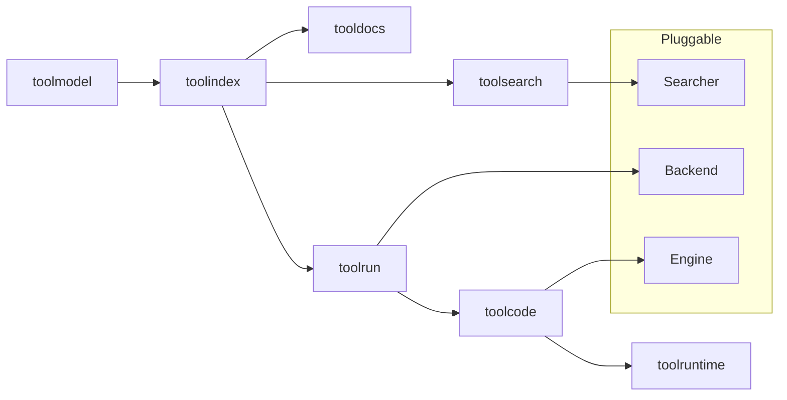

# Pluggable Architecture

The stack is designed so each layer is replaceable without changing the others.
This keeps the core stable while allowing experimentation and integration.

## Extension points

## What you can plug in

- **Search**: swap lexical for BM25 or semantic ranking
- **Execution**: add MCP servers, local handlers, or provider adapters
- **Code execution**: change engines or language runtimes
- **Runtime isolation**: choose the sandbox backend per environment

## Design goal

The default implementations are intentionally simple and safe. Advanced
capabilities are injected rather than baked into the core.
