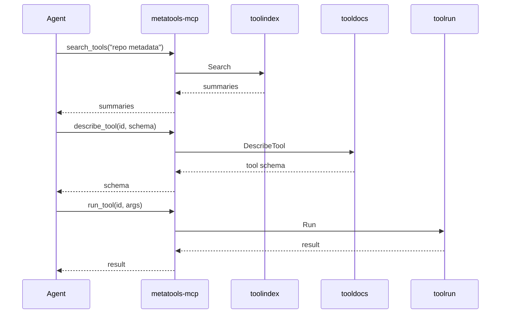

# Progressive Disclosure

Progressive disclosure is the core usability strategy of this stack. It lets
agents discover *just enough* information to choose the right tool, then
retrieve deeper details only when needed.

## Why it matters

- **Lower token cost**: most tools are never fully expanded
- **Faster decisions**: summary-level signals are enough to pick candidates
- **Safer execution**: schema and examples are fetched only after a tool is chosen

## Flow

## Component roles

- `toolindex`: fast, summary-only discovery
- `tooldocs`: structured detail (schema/full/examples)
- `toolrun`: execution with validation + consistent errors
- `toolcode`: optional code-mode orchestration
