# Progressive Disclosure

Progressive disclosure is the core usability strategy of this stack. It lets
agents discover *just enough* information to choose the right tool, then
retrieve deeper details only when needed.

## Why it matters

- **Lower token cost**: most tools are never fully expanded
- **Faster decisions**: summary-level signals are enough to pick candidates
- **Safer execution**: schema and examples are fetched only after a tool is chosen

## Flow

```mermaid
%%{init: {'theme': 'base', 'themeVariables': {'actorBkg': '#2b6cb0', 'actorTextColor': '#fff', 'actorBorder': '#2c5282'}}}%%
sequenceDiagram
    autonumber

    participant Agent as 🤖 AI Agent
    participant MCP as 🔷 metatools-mcp
    participant Index as 📇 tooldiscovery/index
    participant Search as 🔍 tooldiscovery/search
    participant Docs as 📚 tooldiscovery/tooldoc
    participant Run as ▶️ toolexec/run
    participant Cache as 💾 toolops/cache
    participant Observe as 👁️ toolops/observe

    rect rgb(43, 108, 176, 0.1)
        Note over Agent,Search: Phase 1: Discovery (Token-Cheap)
        Agent->>+MCP: search_tools("create issue", limit=5)
        MCP->>+Index: Search(query, limit)
        Index->>+Search: Search(docs, query, limit)
        Search-->>-Index: scored results
        Index-->>-MCP: Summary[] (no schemas)
        MCP-->>-Agent: summaries
    end

    rect rgb(214, 158, 46, 0.1)
        Note over Agent,Docs: Phase 2: Description (On-Demand)
        Agent->>+MCP: describe_tool("github:create_issue", "schema")
        MCP->>+Docs: DescribeTool(id, DetailSchema)
        Docs->>Index: GetTool(id)
        Index-->>Docs: Tool definition
        Docs-->>-MCP: ToolDoc with schema
        MCP-->>-Agent: full tool schema
    end

    rect rgb(56, 161, 105, 0.1)
        Note over Agent,Observe: Phase 3: Execution (Validated)
        Agent->>+MCP: run_tool("github:create_issue", args)
        MCP->>Observe: StartSpan("tool.exec.github.create_issue")
        MCP->>+Cache: Get(toolID, argsHash)
        alt Cache Hit
            Cache-->>MCP: cached result
        else Cache Miss
            MCP->>+Run: Run(ctx, id, args)
            Run->>Run: ValidateInput(args)
            Run->>Run: ResolveBackend()
            Run->>Run: Execute via backend
            Run->>Run: ValidateOutput(result)
            Run-->>-MCP: RunResult
            MCP->>Cache: Set(toolID, argsHash, result)
        end
        Cache-->>-MCP: result
        MCP->>Observe: EndSpan(result)
        MCP-->>-Agent: execution result
    end
```

## Detail Levels

The three progressive detail levels minimize token consumption:

```mermaid
%%{init: {'theme': 'base', 'themeVariables': {'primaryColor': '#3182ce'}}}%%
flowchart LR
    subgraph level1["DetailSummary"]
        S1["📋 1-2 line description"]
        S2["🏷️ Tags"]
        S3["📁 Namespace"]
    end

    subgraph level2["DetailSchema"]
        SS1["📋 Full description"]
        SS2["📐 Input schema"]
        SS3["📤 Output schema"]
    end

    subgraph level3["DetailFull"]
        F1["📋 Everything from Schema"]
        F2["📝 Human-authored notes"]
        F3["💡 1-3 examples"]
        F4["🔗 External references"]
    end

    level1 -->|"Agent selects tool"| level2
    level2 -->|"Needs examples"| level3

    style level1 fill:#38a169,stroke:#276749
    style level2 fill:#d69e2e,stroke:#b7791f
    style level3 fill:#6b46c1,stroke:#553c9a
```

## Component Roles

| Component | Role in Progressive Disclosure |
|-----------|-------------------------------|
| `tooldiscovery/index` | Fast, summary-only discovery |
| `tooldiscovery/search` | Pluggable ranking strategy (BM25, semantic) |
| `tooldiscovery/semantic` | Vector-based intent matching |
| `tooldiscovery/tooldoc` | Structured detail (summary/schema/full/examples) |
| `toolexec/run` | Execution with validation + consistent errors |
| `toolexec/code` | Optional code-mode orchestration |
| `toolops/cache` | Cache results to avoid re-execution |
| `toolops/observe` | Trace execution for debugging |

## Token Economics

Most tools are never fully expanded — progressive disclosure means you only pay
for the detail level you actually need.
