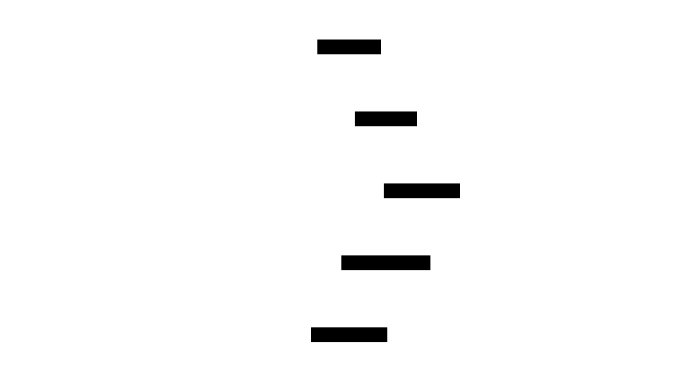

# Protocol Crosswalk (MCP ⇄ A2A ⇄ OpenAI ⇄ Anthropic ⇄ Google)

This page maps the **canonical tool model** to the dominant agent/tool protocols as of 2026-02-02. It exists to keep adapter work grounded in the latest specs and to clarify how we normalize divergent schemas.

## Canonical Model (toolfoundation/adapter)
The stack uses `CanonicalTool` as the hub for adapter conversions. It captures:
- Tool identity (namespace, name, version)
- Display metadata (display name, summary, tags, category)
- Input/Output schemas (JSON Schema superset)
- Execution traits (deterministic, idempotent, streaming, input/output modes)
- Security schemes + requirements
- Source metadata for round-tripping



## Protocol Snapshot (Key Spec Facts)
- MCP 2025-11-25: JSON-RPC 2.0 base protocol; servers expose **resources**, **prompts**, **tools**; clients may offer **sampling**, **roots**, **elicitation**; explicit user consent is required for data access and tool execution.
- A2A (Agent2Agent): layered model with canonical data types, abstract operations, and protocol bindings (JSON-RPC, gRPC, HTTP/REST). The **AgentCard** advertises capabilities, security schemes, and skills.
- OpenAI Agents SDK: tools can be hosted, local runtime, function tools, or agents-as-tools; function tools derive JSON schema from function signatures.
- Anthropic tool use: tools are defined by `name`, `description`, `input_schema`; tool calls return `tool_use` and `tool_result` content blocks; MCP tools can be used by renaming `inputSchema` to `input_schema`.
- Google Gemini function calling: tool definitions are **function declarations** with `name`, `description`, and `parameters` defined using a subset of the OpenAPI schema.

## Crosswalk Table (Concept Mapping)
| Concept | MCP | A2A | OpenAI Agents | Anthropic | Google Gemini |
|---|---|---|---|---|---|
| Tool identity | `name` (+ optional annotations) | `AgentSkill` + Task routing | Tool `name` | Tool `name` | Function `name` |
| Description | `description` | Skill description | Tool description / docstring | `description` | `description` |
| Input schema | `inputSchema` (JSON Schema) | Skill/task inputs (proto → binding) | JSON Schema from function signature | `input_schema` (JSON Schema) | `parameters` (OpenAPI subset) |
| Output schema | `outputSchema` (optional) | Task/Artifact outputs | Tool output (string/structured) | `tool_result` payload | Function response payload |
| Discovery | `search_tools`, `describe_tool` | AgentCard + task listing | Tool lists within Agents SDK | Tools array in request | Tools in request |
| Streaming | MCP streaming responses | Task/Artifact streaming (SSE/stream) | Model streaming events | Streaming tool use | Streaming responses |
| Security | User consent + transport auth | Security schemes + requirements | API key / tool scopes | API key + tool permissions | API key / IAM |

## Adapter Guidance
- Use `CanonicalTool` as the source of truth and **preserve vendor-specific fields** in `SourceMeta` for round-trip fidelity.
- Normalize schemas to JSON Schema internally and **emit feature-loss warnings** for protocols that do not support advanced schema features.
- Treat A2A **AgentCard** as a *tool provider descriptor* and map A2A **skills** to canonical tools.
- Use `CanonicalProvider` to model provider-level capabilities, security schemes, and default I/O modes.
- Map OpenAI/Anthropic/Gemini function tools to canonical tools with `InputSchema` and `OutputSchema`, and surface tool categories as tags or backend hints.

## Sources (URLs)
```
https://modelcontextprotocol.io/specification/2025-11-25
https://a2a-protocol.org/latest/specification/
https://agent2agent.info/specification/
https://openai.github.io/openai-agents-python/tools/
https://platform.openai.com/docs/guides/agents-sdk
https://platform.claude.com/docs/en/agents-and-tools/tool-use/overview
https://ai.google.dev/gemini-api/docs/function-calling
https://docs.cloud.google.com/vertex-ai/generative-ai/docs/multimodal/function-calling
```
