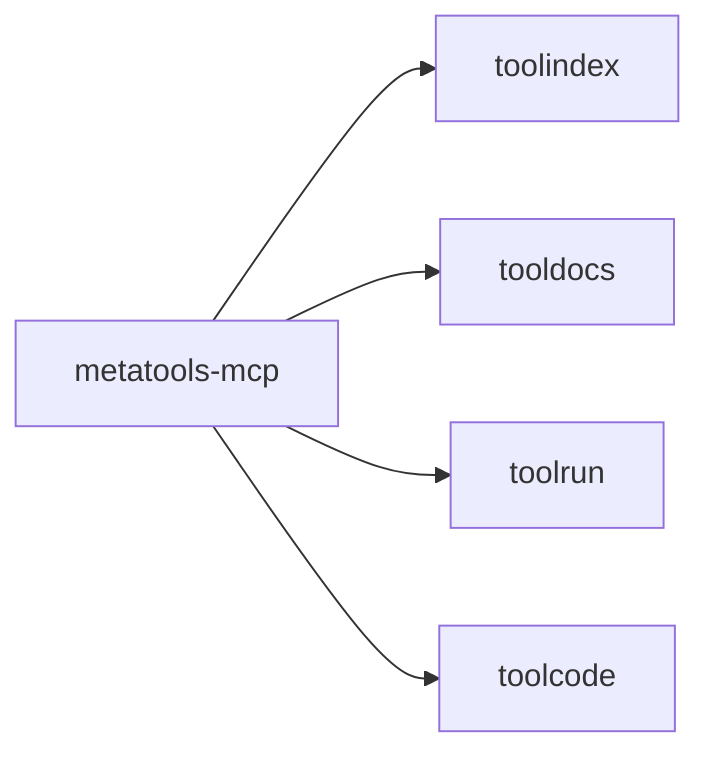

# metatools-mcp

MCP server that exposes the tool stack via standardized MCP tools.

## Responsibilities

- Expose search_tools, list_namespaces, describe_tool, list_tool_examples
- Expose run_tool and run_chain
- Optionally expose execute_code
- Use the official MCP Go SDK

## Example

```go
srv := metatools.NewServer(cfg)
_ = srv.Run(context.Background(), &mcp.StdioTransport{})
```

## Diagram


