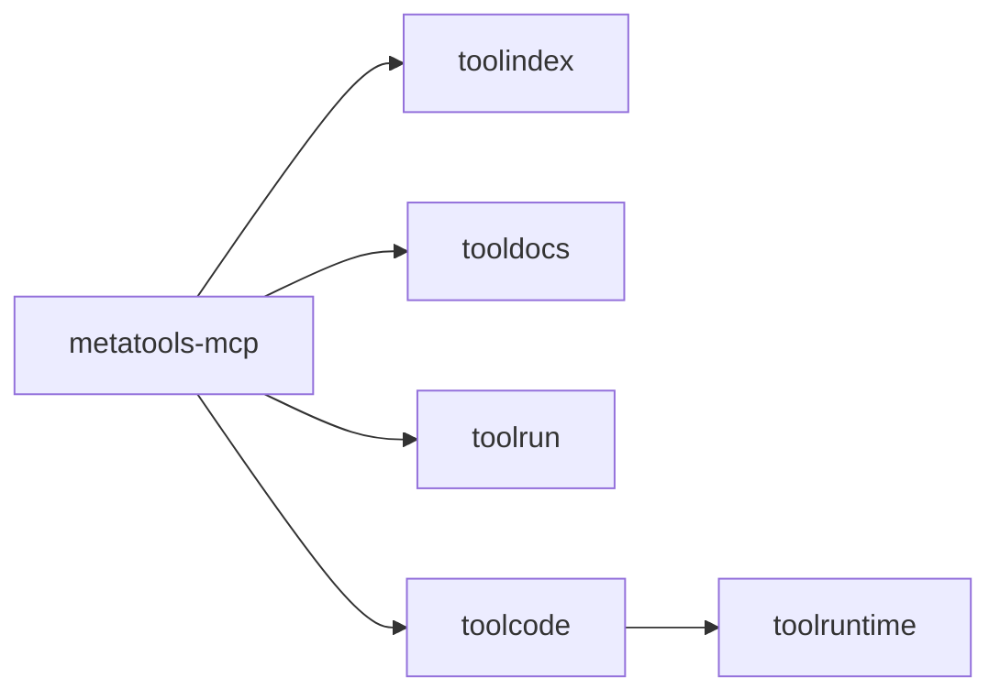

# metatools-mcp

MCP server that exposes the tool stack via standardized MCP tools with a
progressive-disclosure flow.

## Motivation

- Provide a minimal, consistent MCP surface
- Keep discovery cheap and execution safe
- Enable pluggable search and optional code execution

## Core responsibilities

- Expose `search_tools`, `list_namespaces`
- Expose `describe_tool`, `list_tool_examples`
- Expose `run_tool`, `run_chain`
- Optionally expose `execute_code`
- Use the official MCP Go SDK

## Example

```go
srv, _ := server.New(cfg)
_ = srv.Run(context.Background(), &mcp.StdioTransport{})
```

## Diagram



## Usability notes

- Small tool surface reduces prompt complexity
- Schemas and examples are fetched on demand
