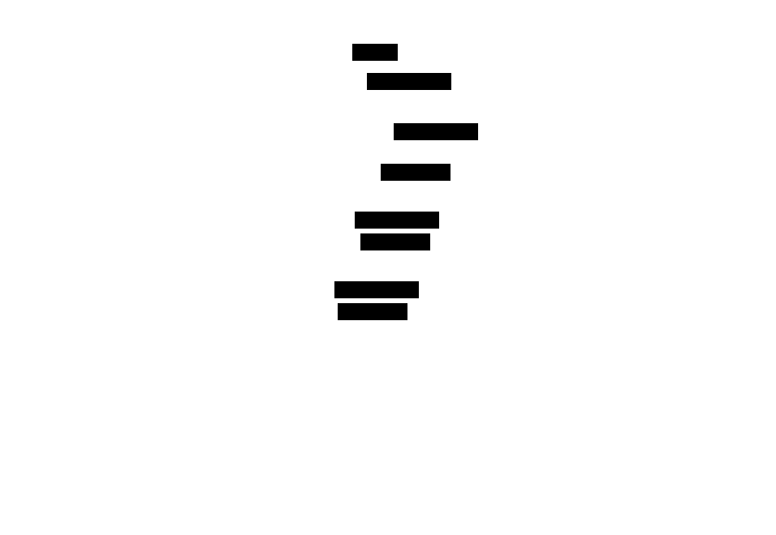

# tooladapter

Protocol-agnostic tool format conversion library. Enables bidirectional
transformation between MCP, OpenAI, and Anthropic tool definitions.

## Motivation

- Expose MCP tools to OpenAI/Anthropic clients without manual conversion
- Track feature loss during format conversion
- Provide deterministic, pure data transforms

## Core types

- `CanonicalTool` (protocol-agnostic intermediate representation)
- `JSONSchema` (superset of all supported schema features)
- `Adapter` (interface for format-specific converters)
- `AdapterRegistry` (thread-safe adapter management)

## Example

```go
import (
  "github.com/jonwraymond/tooladapter"
  "github.com/jonwraymond/tooladapter/adapters"
  "github.com/modelcontextprotocol/go-sdk/mcp"
)

// Set up registry
registry := tooladapter.NewRegistry()
registry.Register(adapters.NewMCPAdapter())
registry.Register(adapters.NewOpenAIAdapter())

// Convert MCP tool to OpenAI format
mcpTool := mcp.Tool{
  Name:        "get_weather",
  Description: "Get weather for a location",
  InputSchema: map[string]any{
    "type": "object",
    "properties": map[string]any{
      "location": map[string]any{"type": "string"},
    },
  },
}

result, _ := registry.Convert(mcpTool, "mcp", "openai")
openaiFunc := result.Tool.(adapters.OpenAIFunction)
```

## Feature Support

| Feature | MCP | OpenAI | Anthropic |
|---------|:---:|:------:|:---------:|
| `$ref/$defs` | Yes | No | No |
| Combinators | Yes | No | Yes |
| Constraints | Yes | Yes | Yes |

## Diagram



## Usability notes

- All conversions are deterministic
- Feature loss generates warnings, not errors
- Round-trip preserves format-specific metadata via `SourceMeta`
