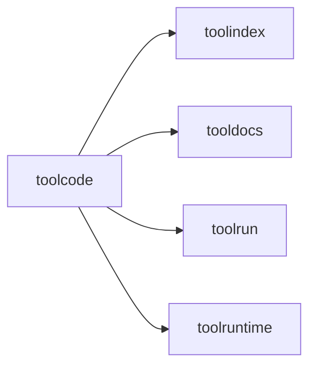

# toolcode

Code-mode orchestration layer that wraps search, docs, and execution into a
single programmable surface.

## Core responsibilities

- Execute short orchestration snippets
- Provide a minimal in-sandbox API (SearchTools, DescribeTool, RunTool)
- Enforce timeouts and limits

## Example

```go
executor := toolcode.NewDefaultExecutor(toolcode.Config{
  Index:  idx,
  Docs:   docs,
  Run:    runner,
  Engine: engine,
})

res, _ := executor.ExecuteCode(ctx, toolcode.ExecuteParams{
  Language: "go",
  Code:     "__out = 2 + 2",
})
```

## Diagram


