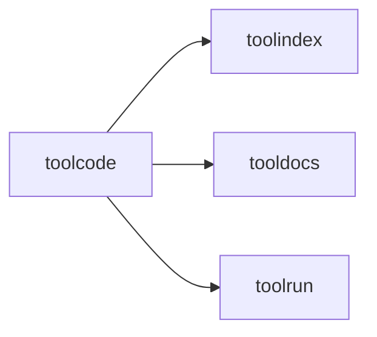

# toolcode

Code-mode orchestration layer that wraps search, docs, and execution into a
single programmable surface.

## Responsibilities

- Execute short orchestration snippets
- Provide a minimal in-sandbox API (SearchTools, DescribeTool, RunTool)
- Enforce timeouts and limits

## Example

```go
executor := toolcode.NewDefaultExecutor(cfg)
res, _ := executor.ExecuteCode(ctx, "go", "__out = 2 + 2", 3*time.Second)
```

## Diagram


