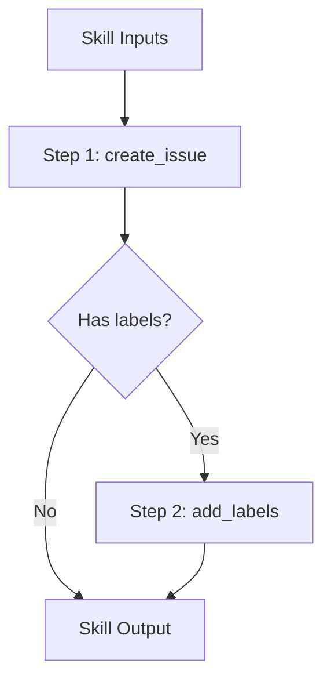

# toolcompose

Composition layer providing filtered tool collections and skill-based workflows.
This repository enables building higher-level abstractions over tools.

## Packages

| Package | Purpose |
|---------|---------|
| `set` | Filtered tool collections with predicates |
| `skill` | Skill-based workflow composition |

## Motivation

- Group related tools into logical collections
- Enable skill-based workflows for common tasks
- Provide filtered views without duplicating tools
- Support composition patterns for complex operations

## set Package

The `set` package provides filtered tool collections using predicates.

### Core Responsibilities

- Create filtered views of tool registries
- Apply namespace, tag, and custom predicates
- Chain filters for complex selections
- Export filtered sets in multiple formats

### Example

```go
import "github.com/jonwraymond/toolcompose/set"

// Create a toolset from index
ts := set.FromIndex(idx)

// Filter by namespace
githubTools := ts.Where(set.Namespace("github"))

// Filter by tags
issueTools := ts.Where(set.HasTag("issues"))

// Chain filters
filtered := ts.
  Where(set.Namespace("github")).
  Where(set.HasTag("issues")).
  Where(set.NameContains("create"))

// List tools
tools := filtered.List()
```

### Built-in Predicates

| Predicate | Description |
|-----------|-------------|
| `Namespace(ns)` | Match exact namespace |
| `HasTag(tag)` | Has specific tag |
| `NameContains(s)` | Name contains substring |
| `DescriptionContains(s)` | Description contains substring |
| `And(p1, p2)` | Both predicates match |
| `Or(p1, p2)` | Either predicate matches |
| `Not(p)` | Predicate does not match |

## skill Package

The `skill` package provides skill-based workflow composition.

### Features

- Define reusable skills from tool combinations
- Parameterize skills with inputs
- Chain skills into workflows
- Handle errors and retries

### Example

```go
import "github.com/jonwraymond/toolcompose/skill"

// Define a skill
createIssueSkill := skill.Define("create-issue", skill.Config{
  Description: "Create a GitHub issue with labels",
  Inputs: []skill.Input{
    {Name: "title", Type: "string", Required: true},
    {Name: "body", Type: "string"},
    {Name: "labels", Type: "[]string"},
  },
  Steps: []skill.Step{
    {Tool: "github:create_issue", Args: map[string]any{
      "title": "{{.title}}",
      "body":  "{{.body}}",
    }},
    {Tool: "github:add_labels", Args: map[string]any{
      "issue":  "{{.prev.number}}",
      "labels": "{{.labels}}",
    }, If: "{{.labels}}"},
  },
})

// Execute skill
result, err := createIssueSkill.Execute(ctx, runner, map[string]any{
  "title":  "Bug report",
  "body":   "Description here",
  "labels": []string{"bug", "priority:high"},
})
```

### Skill Composition



## Diagram


## Key Design Decisions

1. **Immutable sets**: Filter operations return new sets
2. **Lazy evaluation**: Predicates are applied on List()
3. **Template expansion**: Skill args support Go templates
4. **Conditional steps**: Steps can have If conditions

## Links

- [Repository](https://github.com/jonwraymond/toolcompose)
- [set docs](../library-docs-from-repos/toolcompose/set/index.md)
- [skill docs](../library-docs-from-repos/toolcompose/skill/index.md)
