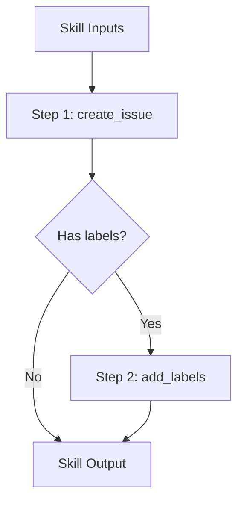

# toolcompose

Composition layer providing filtered tool collections and skill-based workflows.
This repository enables building higher-level abstractions over tools.

## Packages

| Package | Purpose |
|---------|---------|
| `set` | Filtered tool collections with predicates |
| `skill` | Skill-based workflow composition |

## Motivation

- Group related tools into logical collections
- Enable skill-based workflows for common tasks
- Provide filtered views without duplicating tools
- Support composition patterns for complex operations

## set Package

The `set` package provides filtered tool collections using predicates.

### Core Responsibilities

- Create filtered views of tool registries
- Apply namespace, tag, and custom predicates
- Chain filters for complex selections
- Export filtered sets in multiple formats

### Example

```go
import (
  "github.com/jonwraymond/toolcompose/set"
  "github.com/jonwraymond/toolfoundation/adapter"
)

tools := []*adapter.CanonicalTool{
  {Namespace: "github", Name: "create_issue", Tags: []string{"issues"}, InputSchema: &adapter.JSONSchema{Type: "object"}},
  {Namespace: "github", Name: "add_labels", Tags: []string{"issues"}, InputSchema: &adapter.JSONSchema{Type: "object"}},
}

ts, _ := set.NewBuilder("github-issues").
  FromTools(tools).
  WithNamespace("github").
  WithTags([]string{"issues"}).
  WithPolicy(set.DenyTags("danger")).
  Build()

ids := ts.IDs()
```

### Built-in Predicates

| Predicate | Description |
|-----------|-------------|
| `NamespaceFilter(ns...)` | Match any namespace |
| `TagsAny(tags...)` | Match tools with any tag |
| `TagsAll(tags...)` | Match tools with all tags |
| `TagsNone(tags...)` | Match tools with none of the tags |
| `CategoryFilter(cats...)` | Match any category |
| `AllowIDs(ids...)` | Allow only listed IDs |
| `DenyIDs(ids...)` | Exclude listed IDs |

## skill Package

The `skill` package provides skill-based workflow composition.

### Features

- Define declarative skills from tool steps
- Deterministic planning (sorted by step ID)
- Guardrails for max steps and allowed tool IDs
- Execution via a pluggable runner

### Example

```go
import (
  "context"

  "github.com/jonwraymond/toolcompose/skill"
  "github.com/jonwraymond/toolexec/run"
)

sk := skill.Skill{
  Name: "create-issue",
  Steps: []skill.Step{
    {ID: "create", ToolID: "github:create_issue", Inputs: map[string]any{"title": "Bug report"}},
    {ID: "label", ToolID: "github:add_labels", Inputs: map[string]any{"labels": []string{"bug"}}},
  },
}

plan, _ := skill.NewPlanner().Plan(sk)

type runAdapter struct{ exec run.Runner }
func (r runAdapter) Run(ctx context.Context, step skill.Step) (any, error) {
  res, err := r.exec.Run(ctx, step.ToolID, step.Inputs)
  if err != nil {
    return nil, err
  }
  return res.Output, nil
}

runner := run.NewRunner()
_, err := skill.Execute(context.Background(), plan, runAdapter{exec: runner})
```

### Skill Composition



## Diagram


## Key Design Decisions

1. **Deterministic sets**: Toolset listing is sorted and repeatable
2. **Filter + policy**: Filters reduce candidates, policies enforce access
3. **Declarative skills**: Skills are pure definitions, not executors
4. **Pluggable runners**: Execution integrates with any tool runner

## Links

- [Repository](https://github.com/jonwraymond/toolcompose)
- [set docs](../library-docs-from-repos/toolcompose/set/index.md)
- [skill docs](../library-docs-from-repos/toolcompose/skill/index.md)
