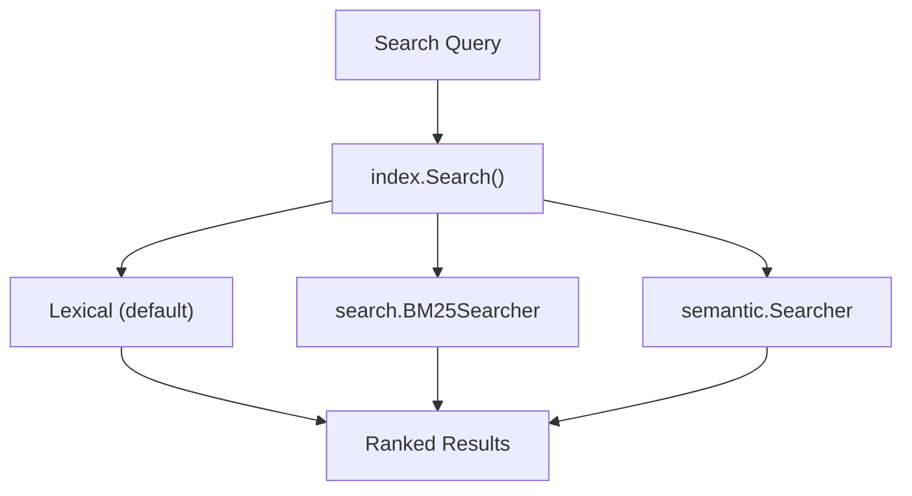

# tooldiscovery

Discovery layer providing tool registry, search strategies, and progressive
documentation. This repository enables efficient tool discovery through multiple
search approaches.

## Packages

| Package | Purpose |
|---------|---------|
| `index` | Global registry and lookup by tool ID |
| `search` | BM25-based full-text search strategy |
| `semantic` | Embedding-based semantic search (optional) |
| `tooldoc` | Progressive documentation with detail levels |

## Motivation

- Keep discovery fast and cheap (token-efficient)
- Decouple search quality from core registry
- Support multiple search strategies (lexical, BM25, semantic)
- Provide progressive disclosure of tool documentation

## index Package

The `index` package provides the global registry and search layer for tools.

### Core Responsibilities

- Register tools + backends
- Search by name/namespace/description/tags
- List namespaces
- Resolve tools by canonical ID

### Example

```go
import "github.com/jonwraymond/tooldiscovery/index"

idx := index.NewInMemoryIndex()

_ = idx.RegisterTool(tool, backend)

summaries, _ := idx.Search("repo", 5)
for _, s := range summaries {
  fmt.Println(s.ID, s.ShortDescription)
}
```

## search Package

The `search` package provides BM25-based full-text search using Bleve.

### Features

- BM25 ranking algorithm
- Field boosts (name: 4x, namespace: 2x, tags: 1x)
- Fuzzy matching support
- Pluggable into index via `SearchStrategy` interface

### Example

```go
import "github.com/jonwraymond/tooldiscovery/search"

searcher, _ := search.NewBM25Searcher(search.DefaultConfig())
defer searcher.Close()

// Index documents
searcher.Index(docs)

// Search
results, _ := searcher.Search("create issue", 10)
```

## semantic Package

The `semantic` package provides embedding-based semantic search (optional).

### Features

- Vector similarity search
- Configurable embedder interface
- Cosine similarity ranking
- Hybrid search support (combine with BM25)

## tooldoc Package

The `tooldoc` package provides progressive documentation with multiple detail levels.

### Detail Levels

| Level | Contents | Use Case |
|-------|----------|----------|
| `Summary` | Name, namespace, short description | Listing, filtering |
| `Description` | Full description, tags, examples | Selection |
| `Schema` | Input/output JSON schemas | Execution |
| `Full` | Everything including metadata | Documentation |

### Example

```go
import "github.com/jonwraymond/tooldiscovery/tooldoc"

store := tooldoc.NewInMemoryStore()

// Get progressive documentation
doc, _ := store.GetDoc(toolID, tooldoc.DetailSchema)
fmt.Println(doc.InputSchema)
```

## Diagram


## Search Strategy Layering



## Key Design Decisions

1. **Pluggable strategies**: Search implementations are swappable
2. **Token efficiency**: Summaries exclude schemas to reduce tokens
3. **Progressive disclosure**: Request only the detail level needed
4. **Optional semantic**: Vector search is opt-in (requires embeddings)

## Links

- [Repository](https://github.com/jonwraymond/tooldiscovery)
- [index docs](../library-docs-from-repos/tooldiscovery/index/index.md)
- [search docs](../library-docs-from-repos/tooldiscovery/search/index.md)
- [semantic docs](../library-docs-from-repos/tooldiscovery/semantic/index.md)
- [tooldoc docs](../library-docs-from-repos/tooldiscovery/tooldoc/index.md)
