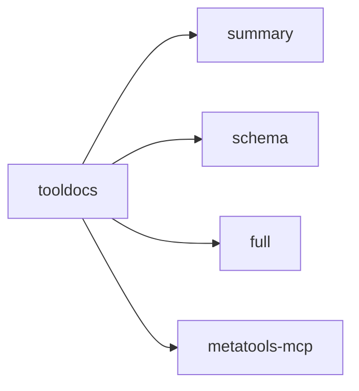

# tooldocs

Progressive, structured documentation and examples for tools. Designed for
schema-first usage and token-efficient guidance.

## Core responsibilities

- Detail tiers: summary → schema → full
- Short usage examples with caps
- Notes and external references

## Example

```go
store := tooldocs.NewInMemoryStore(tooldocs.StoreOptions{Index: idx})

_ = store.RegisterDoc("github:get_repo", tooldocs.DocEntry{
  Summary: "Fetch repository metadata",
  Notes:   "Requires authentication.",
})

schema, _ := store.DescribeTool("github:get_repo", tooldocs.DetailSchema)
examples, _ := store.ListExamples("github:get_repo", 2)
```

## Diagram



## Notes

Examples are bounded to protect token budgets:
- `MaxArgsDepth` and `MaxArgsKeys`
- `MaxSummaryLen`, `MaxNotesLen`, etc.
