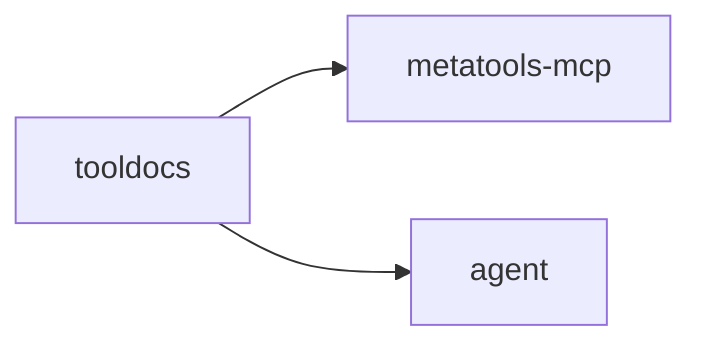

# tooldocs

Progressive, structured documentation and examples for tools. Designed for
schema-first usage and token-efficient guidance.

## Responsibilities

- Provide detail levels (summary, schema, full)
- Serve short usage examples
- Attach doc metadata without changing core schema

## Example

```go
store := tooldocs.NewInMemoryStore(...)

doc, _ := store.DescribeTool("github:get_repo", tooldocs.DetailSchema)
examples, _ := store.ListExamples("github:get_repo", 2)
```

## Diagram


