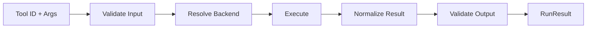

# toolexec

Execution layer providing tool running, code orchestration, and runtime
isolation. This repository handles the actual execution of tools across
different backend types.

## Packages

| Package | Purpose |
|---------|---------|
| `run` | Core tool execution and chaining |
| `code` | Code-based tool orchestration |
| `runtime` | Sandbox and runtime isolation |
| `backend` | Backend registry and resolution |

## Motivation

- Execute tools with proper validation and error handling
- Support multiple backend types (local, provider, MCP server)
- Enable tool chaining and orchestration
- Provide secure runtime isolation

## run Package

The `run` package provides the core tool execution engine.

### Core Responsibilities

- Validate input against tool schema
- Resolve backend and execute
- Normalize results
- Validate output against schema

### Example

```go
import "github.com/jonwraymond/toolexec/run"

runner := run.NewRunner(run.Config{
  Index:    idx,
  Backends: backends,
})

result, err := runner.Run(ctx, "github:create_issue", map[string]any{
  "owner": "jonwraymond",
  "repo":  "toolexec",
  "title": "New issue",
})
```

### Execution Pipeline



## code Package

The `code` package provides code-based tool orchestration for complex workflows.

### Features

- Multi-tool orchestration
- Conditional execution
- Result aggregation
- Error handling with retries

### Example

```go
import "github.com/jonwraymond/toolexec/code"

executor := code.NewExecutor(runner)

// Execute a workflow
result, err := executor.Execute(ctx, `
  issue := run("github:create_issue", {title: "Bug fix"})
  run("github:add_labels", {issue: issue.number, labels: ["bug"]})
`)
```

## runtime Package

The `runtime` package provides sandbox and runtime isolation for tool execution.

### Supported Runtimes

| Runtime | Isolation | Use Case |
|---------|-----------|----------|
| `local` | Process | Trusted tools |
| `docker` | Container | Untrusted code |
| `wasm` | Sandbox | Browser/edge |

### Example

```go
import (
  "github.com/jonwraymond/tooldiscovery/tooldoc"
  "github.com/jonwraymond/toolexec/runtime"
  "github.com/jonwraymond/toolexec/runtime/backend/unsafe"
  "github.com/jonwraymond/toolexec/runtime/gateway/direct"
)

docs := tooldoc.NewInMemoryStore(tooldoc.StoreOptions{Index: idx})
gateway := direct.New(direct.Config{Index: idx, Docs: docs, Runner: runner})

rt := runtime.NewDefaultRuntime(runtime.RuntimeConfig{
  Backends: map[runtime.SecurityProfile]runtime.Backend{
    runtime.ProfileDev: unsafe.New(unsafe.Config{RequireOptIn: true}),
  },
  DefaultProfile: runtime.ProfileDev,
})

result, err := rt.Execute(ctx, runtime.ExecuteRequest{
  Language: "go",
  Code:     `__out = "ok"`,
  Profile:  runtime.ProfileDev,
  Gateway:  gateway,
  Metadata: map[string]any{"unsafeOptIn": true},
})
```

## backend Package

The `backend` package provides backend registry and resolution.

### Backend Types

| Type | Description |
|------|-------------|
| `local` | In-process handler function |
| `provider` | External tool provider |
| `mcp` | Remote MCP server |

### Example

```go
import "github.com/jonwraymond/toolexec/backend"

registry := backend.NewRegistry()

// Register a local backend
registry.Register("calculator", backend.Local(func(ctx context.Context, args any) (any, error) {
  // Implementation
}))

// Resolve backend for tool
b, err := registry.Resolve(tool.Backend)
```

## Diagram


## Key Design Decisions

1. **Schema validation**: Both input and output are validated
2. **Backend abstraction**: Execution is decoupled from backend type
3. **Pluggable runtimes**: Security profiles are configurable
4. **Chaining support**: Tools can call other tools

## Links

- [Repository](https://github.com/jonwraymond/toolexec)
- [Docs index](../library-docs-from-repos/toolexec/index.md)
- [Schemas and contracts](../library-docs-from-repos/toolexec/schemas.md)
- [Architecture](../library-docs-from-repos/toolexec/architecture.md)
- [Design notes](../library-docs-from-repos/toolexec/design-notes.md)
- [User journey](../library-docs-from-repos/toolexec/user-journey.md)
- [Examples](../library-docs-from-repos/toolexec/examples.md)
