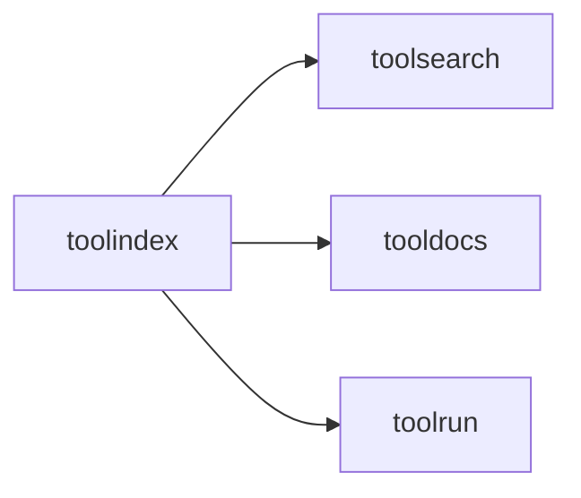

# toolindex

Global registry and search layer for tools. Provides progressive discovery and
canonical lookup by tool ID.

## Responsibilities

- Register tools and backends
- Search and list namespaces
- Resolve tools by ID

## Example

```go
idx := toolindex.NewInMemoryIndex()
_ = idx.RegisterTools([]toolmodel.Tool{tool}, backend)

summaries, _ := idx.Search("repo", 5)
```

## Diagram


