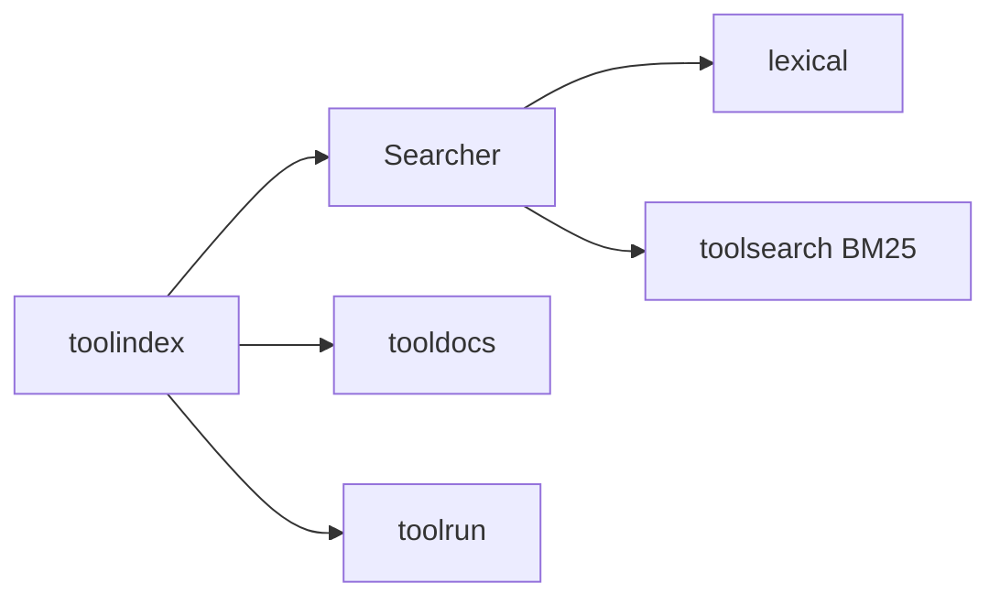

# toolindex

Global registry and search layer for tools. Provides progressive discovery and
canonical lookup by tool ID.

## Core responsibilities

- Register tools + backends
- Search by name/namespace/description/tags
- List namespaces
- Resolve tools by canonical ID

## Example

```go
idx := toolindex.NewInMemoryIndex()

_ = idx.RegisterTool(tool, backend)

summaries, _ := idx.Search("repo", 5)
for _, s := range summaries {
  fmt.Println(s.ID, s.ShortDescription)
}
```

## Diagram



## Integration note

`toolindex` is the discovery backbone for `metatools-mcp`.
