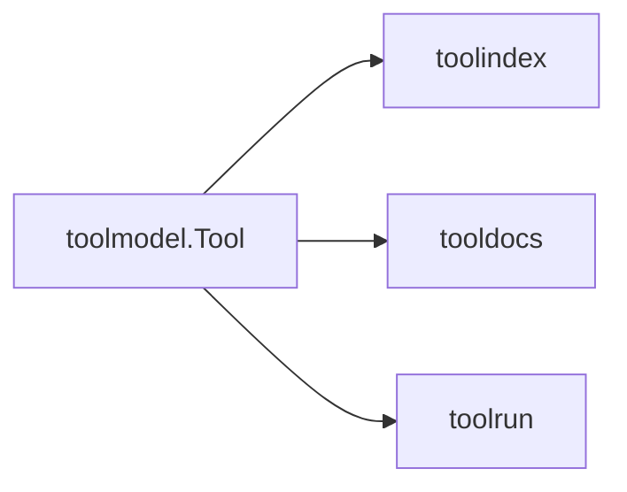

# toolmodel

Canonical schema definitions for all tools. This is the source of truth for
IDs, schemas, tags, and backend bindings.

## Core types

- `Tool` (embeds MCP `mcp.Tool`, adds `Namespace`, `Version`, `Tags`)
- `ToolBackend` (execution binding: mcp, provider, local)
- `SchemaValidator` (input/output validation)

## Example

```go
import (
  "github.com/jonwraymond/toolmodel"
  "github.com/modelcontextprotocol/go-sdk/mcp"
)

tool := toolmodel.Tool{
  Namespace: "github",
  Tool: mcp.Tool{
    Name:        "get_repo",
    Description: "Fetch repository metadata",
    InputSchema: map[string]any{
      "type": "object",
      "properties": map[string]any{
        "owner": {"type": "string"},
        "repo":  {"type": "string"},
      },
      "required": []string{"owner", "repo"},
    },
  },
  Tags: toolmodel.NormalizeTags([]string{"GitHub", "repos"}),
}

_ = tool.Validate()
```

## Diagram



## Notes

- JSON Schema 2020-12 is assumed when `$schema` is missing.
- External `$ref` resolution is blocked for safety.
