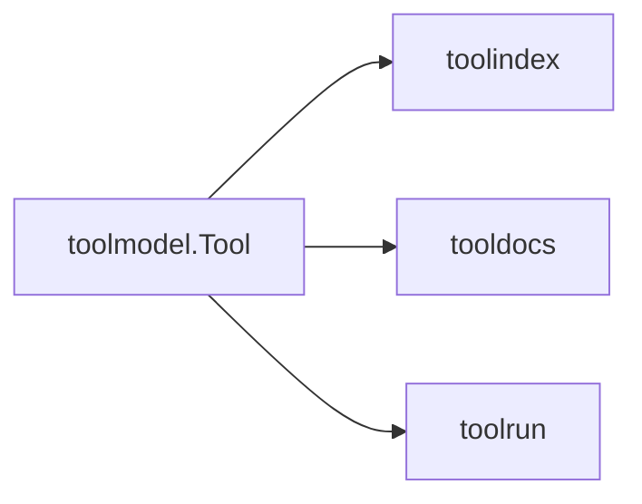

# toolmodel

Canonical schema definitions for all tools. This is the source of truth for
IDs, schemas, and annotations.

## Responsibilities

- Define the MCP-aligned `Tool` structure
- Provide JSON Schema helpers for input/output validation
- Generate stable tool IDs

## Example

```go
import "github.com/jonwraymond/toolmodel"

tool := toolmodel.Tool{
  Name:        "get_repo",
  Title:       "Get Repo",
  Description: "Fetch repository metadata",
  InputSchema:  []byte(`{"type":"object","properties":{"owner":{"type":"string"},"repo":{"type":"string"}},"required":["owner","repo"]}`),
  OutputSchema: []byte(`{"type":"object","properties":{"full_name":{"type":"string"}}}`),
}

id := tool.ToolID("github") // github:get_repo
```

## Diagram


