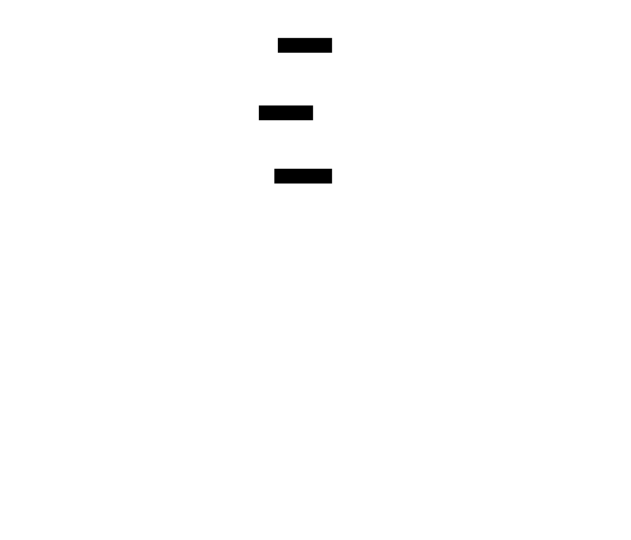

# toolobserve

Observability library for tool execution: tracing, metrics, and structured logs.

## Motivation

- Provide consistent telemetry across the stack
- Avoid instrumentation duplication in each repo
- Keep observability opt-in and backend-agnostic

## Core responsibilities

- Create spans around tool execution
- Record metrics (counts, latency, errors)
- Emit structured logs with tool context

## Position in the Stack

```
toolrun/toolruntime --> toolobserve --> exporters
```

## Diagram



## Usability notes

- Pure instrumentation (no execution/transport)
- Context propagation is required in all call paths
- Exporters are configured by the caller

## Links

- Repository: https://github.com/jonwraymond/toolobserve
- Library docs: ../library-docs-from-repos/toolobserve/index.md
