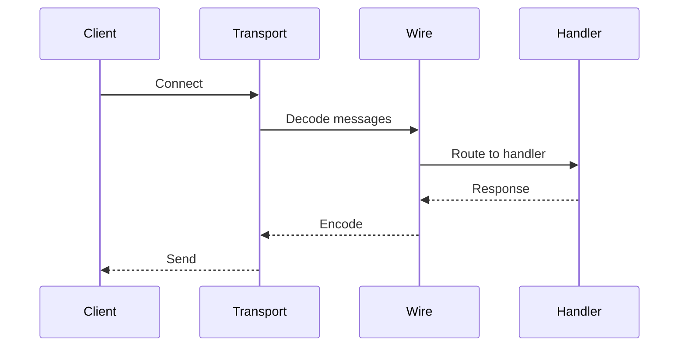

# toolprotocol

Protocol layer providing MCP primitives, transport abstractions, and wire formats.
This repository contains the low-level protocol handling for MCP communication.

## Packages

| Package | Purpose |
|---------|---------|
| `content` | Content type handling and serialization |
| `discover` | Protocol-level discovery primitives |
| `transport` | Transport abstractions (stdio, SSE, WebSocket) |
| `wire` | Wire format encoding/decoding |

## Motivation

- Provide clean abstractions over MCP protocol details
- Support multiple transport mechanisms
- Handle content negotiation and serialization
- Enable protocol extensions and customization

## content Package

The `content` package handles content type serialization and negotiation.

### Features

- JSON and binary content support
- Content type negotiation
- Streaming content handling
- Attachment support

### Example

```go
import "github.com/jonwraymond/toolprotocol/content"

// Create content handler
handler := content.NewHandler(content.Config{
  DefaultType: content.TypeJSON,
  MaxSize:     10 * 1024 * 1024, // 10MB
})

// Serialize content
data, contentType, err := handler.Serialize(result)

// Deserialize content
var result any
err := handler.Deserialize(data, contentType, &result)
```

## discover Package

The `discover` package provides protocol-level discovery primitives.

### Features

- Server capability negotiation
- Tool listing protocol
- Resource discovery
- Prompt listing

### Example

```go
import "github.com/jonwraymond/toolprotocol/discover"

// Create discoverer
disc := discover.New(transport)

// Get server capabilities
caps, err := disc.Initialize(ctx)

// List available tools
tools, cursor, err := disc.ListTools(ctx, nil)
```

## transport Package

The `transport` package provides transport abstractions for MCP communication.

### Supported Transports

| Transport | Use Case |
|-----------|----------|
| `stdio` | CLI tools, subprocess communication |
| `sse` | HTTP Server-Sent Events |
| `websocket` | Bidirectional WebSocket |

### Example

```go
import "github.com/jonwraymond/toolprotocol/transport"

// Create stdio transport
t := transport.NewStdio(os.Stdin, os.Stdout)

// Create SSE transport
t := transport.NewSSE(transport.SSEConfig{
  Endpoint: "/events",
})

// Send message
err := t.Send(ctx, message)

// Receive message
msg, err := t.Receive(ctx)
```

## wire Package

The `wire` package handles wire format encoding and decoding.

### Features

- JSON-RPC 2.0 encoding
- Message framing
- Error code handling
- Batch request support

### Example

```go
import "github.com/jonwraymond/toolprotocol/wire"

// Create encoder/decoder
codec := wire.NewJSONRPCCodec()

// Encode request
data, err := codec.EncodeRequest(wire.Request{
  Method: "tools/call",
  Params: params,
})

// Decode response
var resp wire.Response
err := codec.DecodeResponse(data, &resp)
```

## Diagram


## Protocol Flow



## Key Design Decisions

1. **Transport agnostic**: Protocol logic is decoupled from transport
2. **Streaming support**: Content can be streamed for large payloads
3. **Standards compliance**: JSON-RPC 2.0, MCP spec 2025-11-25
4. **Extensible**: Custom transports and content types supported

## Links

- [Repository](https://github.com/jonwraymond/toolprotocol)
- [content docs](../library-docs-from-repos/toolprotocol/content/index.md)
- [discover docs](../library-docs-from-repos/toolprotocol/discover/index.md)
- [transport docs](../library-docs-from-repos/toolprotocol/transport/index.md)
- [wire docs](../library-docs-from-repos/toolprotocol/wire/index.md)
