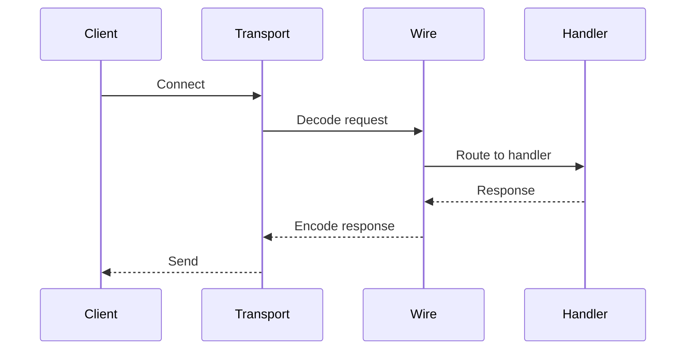

# toolprotocol

Protocol layer providing transport, wire format, and protocol primitives for MCP,
A2A, and ACP integrations.

## Packages

| Package | Purpose |
|---------|---------|
| `content` | Unified content parts (text, image, audio, file, resource) |
| `discover` | Service discovery + capability negotiation |
| `transport` | Transport interfaces (stdio, SSE, streamable HTTP) |
| `wire` | Protocol wire encoding (MCP, A2A, ACP) |
| `stream` | Streaming events for progress/partial/complete |
| `session` | Client session store + context helpers |
| `task` | Long-running task lifecycle + subscriptions |
| `resource` | MCP resources registry + subscriptions |
| `prompt` | Prompt templates + registry |
| `elicit` | User input elicitation (text/confirm/choice/form) |

## Contracts (Highlights)

- **Transport**: concurrent-safe; `Serve` honors context; `Close` is idempotent.
- **Wire**: deterministic encode/decode; capabilities reflect real support.
- **Content**: immutable content parts; MIME type always matches payload.
- **Stream**: event order preserved; `Done` closes on `Close`.

## Example: Wire + Transport

```go
import (
  "context"

  "github.com/jonwraymond/toolprotocol/transport"
  "github.com/jonwraymond/toolprotocol/wire"
)

type server struct{}

func (s *server) ServeTransport(ctx context.Context, t transport.Transport) error {
  return nil
}

ctx := context.Background()
codec := wire.NewMCP()
payload, _ := codec.EncodeRequest(ctx, &wire.Request{
  ID:     "1",
  Method: "tools/list",
})

tp, _ := transport.New("stdio", nil)
_ = payload
_ = tp.Serve(ctx, &server{})
```

## Diagram


## Protocol Flow



## Links

- [Repository](https://github.com/jonwraymond/toolprotocol)
- [Docs index](../library-docs-from-repos/toolprotocol/index.md)
- [Architecture](../library-docs-from-repos/toolprotocol/architecture.md)
- [Schemas and contracts](../library-docs-from-repos/toolprotocol/schemas.md)
- [Examples](../library-docs-from-repos/toolprotocol/examples.md)
- [Design notes](../library-docs-from-repos/toolprotocol/design-notes.md)
- [User journey](../library-docs-from-repos/toolprotocol/user-journey.md)
