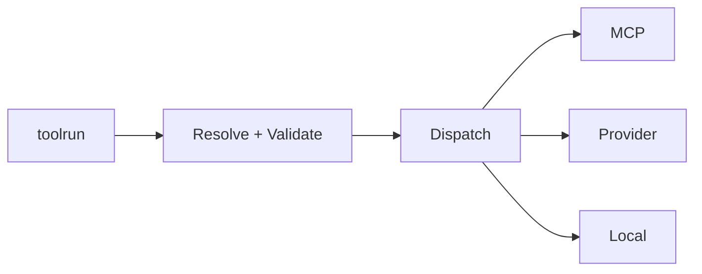

# toolrun

Execution layer for tools and chains. Backend-agnostic and aligned to MCP
`run_tool` and `run_chain` semantics.

## Core responsibilities

- Resolve tools and backends
- Validate inputs/outputs with toolmodel schemas
- Dispatch to MCP, provider, or local backends
- Execute chains with `previous` injection

## Example

```go
runner := toolrun.NewRunner(
  toolrun.WithIndex(idx),
  toolrun.WithLocalRegistry(localRegistry),
)

result, _ := runner.Run(ctx, "github:get_repo", map[string]any{
  "owner": "octo",
  "repo":  "hello",
})
```

## Diagram


