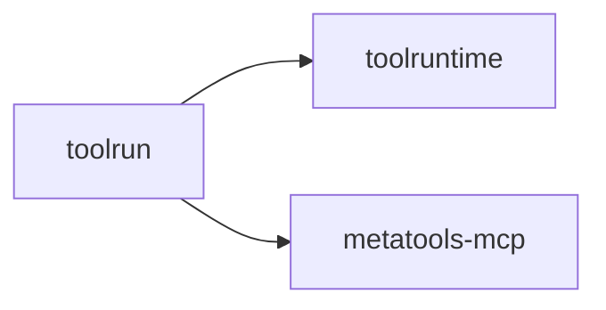

# toolrun

Execution layer for tools and chains. Backend-agnostic and aligned to MCP
run_tool and run_chain semantics.

## Responsibilities

- Execute tools by ID
- Validate inputs and outputs (via toolmodel schemas)
- Run chains with step-wise results

## Example

```go
runner := toolrun.NewDefaultRunner(...)
result, _ := runner.Run(ctx, "github:get_repo", map[string]any{"owner":"o","repo":"r"})
```

## Diagram


