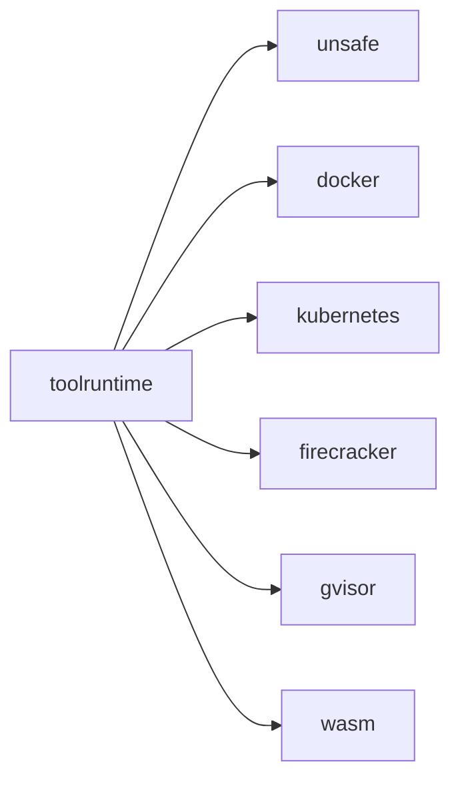

# toolruntime

Sandbox/runtime abstraction for executing code securely. Provides multiple
backends with a single interface.

## Core responsibilities

- Runtime interface + default implementation
- Backends (unsafe host, docker, kubernetes, gvisor, firecracker, wasm)
- Security profiles and execution limits

## Example

```go
rt := toolruntime.NewDefaultRuntime(toolruntime.RuntimeConfig{
  Backends: map[toolruntime.SecurityProfile]toolruntime.Backend{
    toolruntime.ProfileDev: unsafe.New(unsafe.Config{Mode: unsafe.ModeSubprocess}),
  },
  DefaultProfile: toolruntime.ProfileDev,
})
```

## Diagram


