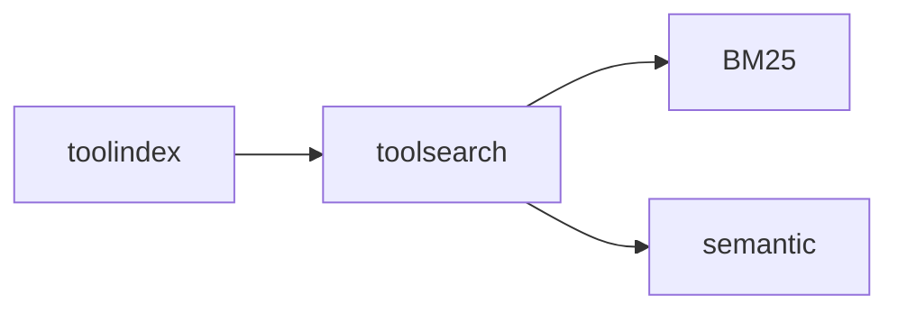

# toolsearch

Search strategy library that plugs into toolindex. Currently provides BM25 with
room for semantic/hybrid search.

## Responsibilities

- Provide BM25 and future ranking strategies
- Keep search logic decoupled from the index
- Support pluggable scoring for experiments

## Example

```go
engine := toolsearch.NewBM25Engine(toolsearch.BM25Config{K1: 1.5, B: 0.75})
idx := toolindex.NewInMemoryIndex(toolindex.WithSearchEngine(engine))
```

## Diagram


