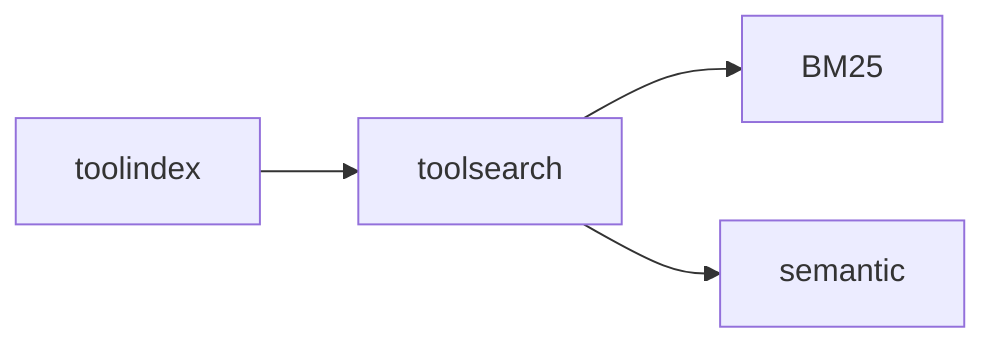

# toolsearch

Search strategy library that plugs into toolindex. Currently provides BM25 with
room for semantic/hybrid search.

## Motivation

- Keep `toolindex` minimal
- Allow search experimentation without destabilizing the core
- Improve relevance without changing IDs or schemas

## Core responsibilities

- Provide BM25 ranking
- Keep search logic decoupled from the index
- Support pluggable scoring

## Example

```go
searcher := toolsearch.NewBM25Searcher(toolsearch.BM25Config{K1: 1.5, B: 0.75})
idx := toolindex.NewInMemoryIndex(toolindex.IndexOptions{Searcher: searcher})
```

## Diagram



## Usability notes

- Deterministic ranking avoids jitter
- BM25 is opt-in and isolated by design
