# AI Tools Stack

Welcome to the unified documentation for the AI Tools Stack. This site brings
all tool libraries together in one place and shows how they compose into a
progressive-disclosure MCP surface.

**Simple and elegant at the core, extensible through modular, pluggable architecture.**

## Deep dives
- [Design Notes Index](architecture/design-notes.md)
- [User Journeys Index](architecture/user-journeys.md)
- [Stack Changelog](operations/stack-changelog.md)

## What this stack provides

| Layer | Components | Purpose |
|-------|------------|---------|
| **Foundation** | toolfoundation (model, adapter, version) | Canonical schemas + protocol adapters |
| **Discovery** | tooldiscovery (index, tooldoc, search, semantic) | Registry, docs, search strategies |
| **Execution** | toolexec (run, code, runtime, backend) | Execution, chaining, sandboxing |
| **Execution (Integrations)** | toolexec-integrations (kubernetes, proxmox, remotehttp) | Concrete runtime clients |
| **Composition** | toolcompose (set, skill) | Filtered collections, skill workflows |
| **Operations** | toolops (observe, cache, auth, resilience, health) | Observability + production controls |
| **Protocol** | toolprotocol (transport, wire, content, stream, task, session, resource, prompt, elicit) | Protocol primitives |
| **Surface** | metatools-mcp | MCP server wiring |

## High-level Flow

!!! tip "Diagram controls"
    Click any diagram to open a zoomable, pannable view. Scroll/pinch to zoom and drag to pan.

```mermaid
%%{init: {'theme': 'base', 'themeVariables': {'primaryColor': '#2b6cb0', 'primaryTextColor': '#fff', 'lineColor': '#4a5568'}}}%%
flowchart TB
    subgraph client["Client"]
        Agent["🤖 AI Agent"]
    end

    subgraph surface["MCP Surface"]
        MCP["🔷 metatools-mcp<br/><small>JSON-RPC / SSE</small>"]
    end

    subgraph operations["Operations"]
        Observe["👁️ toolops/observe"]
        Cache["💾 toolops/cache"]
        Auth["🔐 toolops/auth"]
        Resilience["🧯 toolops/resilience"]
        Health["💚 toolops/health"]
    end

    subgraph composition["Composition"]
        Toolset["📦 toolcompose/set"]
        Skill["🎯 toolcompose/skill"]
    end

    subgraph protocol["Protocol"]
        Wire["🔄 toolprotocol/wire"]
        Transport["📡 toolprotocol/transport"]
        Content["🧩 toolprotocol/content"]
    end

    subgraph execution["Execution"]
        Run["▶️ toolexec/run"]
        Code["💻 toolexec/code"]
        Runtime["🏃 toolexec/runtime"]
    end

    subgraph discovery["Discovery"]
        Index["📇 tooldiscovery/index"]
        Docs["📚 tooldiscovery/tooldoc"]
        Search["🔍 tooldiscovery/search"]
        Semantic["🧠 tooldiscovery/semantic"]
    end

    subgraph foundation["Foundation"]
        Model["🧱 toolfoundation/model"]
        Adapter["🧩 toolfoundation/adapter"]
        Version["🏷️ toolfoundation/version"]
    end

    subgraph backends["Backends"]
        Local["🏠 Local"]
        Provider["🔌 Provider"]
        MCPBackend["📡 MCP Server"]
        Docker["🐳 Docker"]
    end

    Agent <-->|"MCP Protocol"| MCP

    MCP --> Observe
    MCP --> Cache
    MCP --> Auth
    MCP --> Resilience
    MCP --> Health

    MCP --> Toolset
    MCP --> Skill

    MCP --> Wire
    MCP --> Transport
    MCP --> Content

    MCP --> Index
    MCP --> Docs
    Index --> Search
    Index --> Semantic

    MCP --> Run
    Run --> Code
    Code --> Runtime

    Toolset --> Index
    Toolset --> Model
    Skill --> Run

    Index --> Model
    Docs --> Model
    Adapter --> Model
    Version --> Model

    Run --> Local
    Run --> Provider
    Run --> MCPBackend
    Runtime --> Docker

    style client fill:#4a5568,stroke:#2d3748,stroke-width:2px
    style surface fill:#2b6cb0,stroke:#2c5282,stroke-width:3px
    style operations fill:#e53e3e,stroke:#c53030
    style composition fill:#6b46c1,stroke:#553c9a
    style protocol fill:#d69e2e,stroke:#b7791f
    style execution fill:#38a169,stroke:#276749
    style discovery fill:#3182ce,stroke:#2c5282
    style foundation fill:#718096,stroke:#4a5568
    style backends fill:#2d3748,stroke:#1a202c
```

## Progressive Disclosure

The core usability pattern: **discover → describe → execute**

```mermaid
%%{init: {'theme': 'base', 'themeVariables': {'actorBkg': '#2b6cb0', 'actorTextColor': '#fff'}}}%%
sequenceDiagram
    autonumber
    participant Agent as 🤖 Agent
    participant MCP as 🔷 metatools-mcp

    rect rgb(43, 108, 176, 0.1)
        Note over Agent,MCP: 1. Discovery (Token-Cheap)
        Agent->>MCP: search_tools("create issue")
        MCP-->>Agent: Summary[] (no schemas)
    end

    rect rgb(214, 158, 46, 0.1)
        Note over Agent,MCP: 2. Description (On-Demand)
        Agent->>MCP: describe_tool(id, "schema")
        MCP-->>Agent: Full tool schema
    end

    rect rgb(56, 161, 105, 0.1)
        Note over Agent,MCP: 3. Execution (Validated)
        Agent->>MCP: run_tool(id, args)
        MCP-->>Agent: Execution result
    end
```

## Quickstart

1. Start with `toolfoundation/model` for your canonical schemas
2. Register tools in `tooldiscovery/index` for discovery
3. Add docs/examples in `tooldiscovery/tooldoc`
4. Execute tools via `toolexec/run`
5. Expose the MCP surface using `metatools-mcp`

See the **Components** section for per-library examples and diagrams.

## Design Notes and User Journeys

For deeper context, see the aggregated indexes:

- [Design Notes Index](architecture/design-notes.md) — per‑repo tradeoffs and error semantics
- [User Journeys Index](architecture/user-journeys.md) — end‑to‑end agent workflows

## Docs from each repo

Under **Library Docs (from repos)** you will find the docs imported directly
from each repository at build time.
