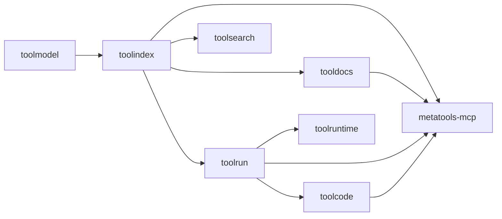

# AI Tools Stack

Welcome to the unified documentation for the AI Tools Stack. This site brings
all tool libraries together in one place and shows how they compose into a
progressive-disclosure MCP surface.

## What this stack provides

- **Canonical tool schemas** (toolmodel)
- **Registry and discovery** (toolindex)
- **Docs and examples** (tooldocs)
- **Execution and chaining** (toolrun)
- **Code-mode orchestration** (toolcode)
- **Sandbox/runtime backends** (toolruntime)
- **Search strategies** (toolsearch)
- **MCP server wiring** (metatools-mcp)

## Design Notes and User Journeys

For deeper context, see the aggregated indexes:

- [Design Notes Index](architecture/design-notes.md) — per‑repo tradeoffs and error semantics
- [User Journeys Index](architecture/user-journeys.md) — end‑to‑end agent workflows

## High-level flow

## Quickstart

1. Start with `toolmodel` for your canonical schemas.
2. Register tools in `toolindex` for discovery.
3. Add docs/examples in `tooldocs`.
4. Execute tools via `toolrun`.
5. Expose the MCP surface using `metatools-mcp`.

See the **Components** section for per-library examples and diagrams.

## Docs from each repo

Under **Library Docs (from repos)** you will find the docs imported directly
from each repository at build time.
